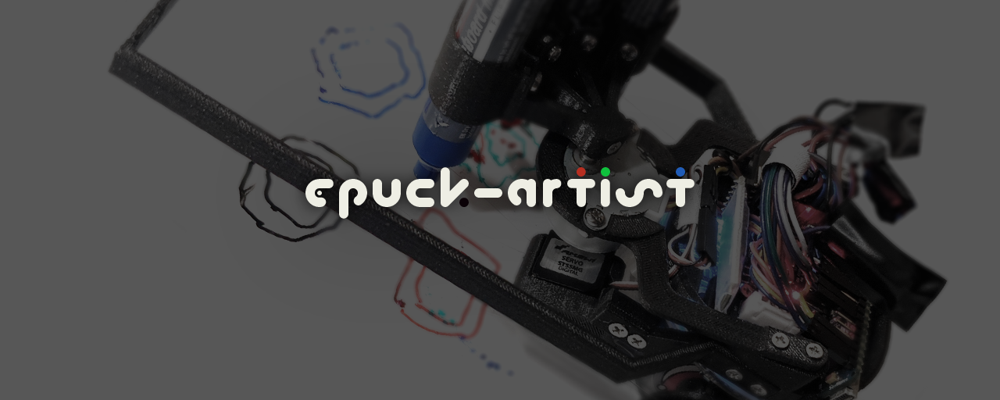

# epuck-artist

An edge processing, 4-color equipped wall plotter. Embedded Systems and Robotics semester project @EPFL using the e-puck 2 robot from [GCtronic](https://www.gctronic.com/).

## Features
- Reproduction of any subject (90 x 100) in 4 different colors
- Semi-automatic calibration
- Interactive starting position configuration
## Requirements
### Python 3.x
#### External libraries
  - serial
  - PIL
  - numpy

### VSCode with PlatformIO IDE
#### Libraries
  - NeoSWSerial
  - ServoTimer2
  - Stepper

### Hardware
| Peripheral                  | Model                                                                                                    |
|-----------------------------|----------------------------------------------------------------------------------------------------------|
| Robot                       | [e-puck2 (GCtronic)](https://www.gctronic.com/e-puck2.php)                                               |
| Board                       | [Arduino Nano ATMega328](https://store.arduino.cc/arduino-nano)                                          | 
| Bluetooth module            | [Velleman HC-05](https://www.velleman.eu/products/view/?id=435518)                                       | 
| Servo motor                 | [ST55MG](https://amewi.com/AMX-Racing-Micro-Digital-Servo-ST55MG)                                        |
| Stepper motor and driver    | [Gear Stepper Motor Driver Pack](https://www.seeedstudio.com/Gear-Stepper-Motor-Driver-Pack-p-3200.html) |

## Demo:

